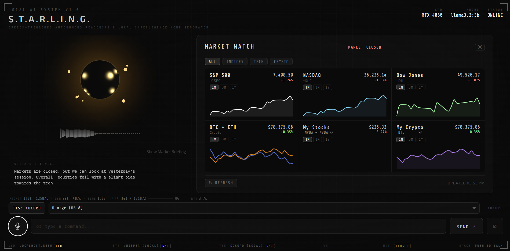
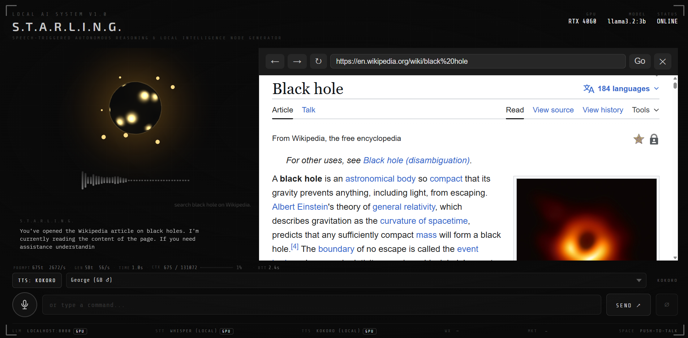

# S.T.A.R.L.I.N.G. Toolkit

Voice-activated tool modules built into S.T.A.R.L.I.N.G. Each tool is a self-contained
intercept in the voice dispatch chain — triggered before the LLM with no impact on the
core chat pipeline.

See [`TRIGGER_PHRASES.md`](./TRIGGER_PHRASES.md) for the full voice command reference.

---

## Tools

| # | Tool | Guide | Backend | Status |
|---|---|---|---|---|
| 1 | Time & Date | [`markdown/complete/TIME.md`](../markdown/complete/TIME.md) | None | ✅ Done |
| 2 | Timers | [`markdown/complete/TIMER.md`](../markdown/complete/TIMER.md) | None | ✅ Done |
| 3 | Weather | [`markdown/complete/WEATHER.md`](../markdown/complete/WEATHER.md) | Open-Meteo (free, no key) | ✅ Done |
| 4 | News Briefing | [`markdown/complete/NEWS.md`](../markdown/complete/NEWS.md) | RSS / feedparser (free) | ✅ Done |
| 5 | Stocks & Crypto | [`markdown/STOCKS.md`](../markdown/STOCKS.md) | yfinance (unofficial) | ✅ Done |
| 6 | Wake Word & Interrupt | [`markdown/WAKE_WORD.md`](../markdown/WAKE_WORD.md) | None | 🔲 Planned |
| 7 | In-UI Browser Panel | [`markdown/WEBCALL.md`](../markdown/WEBCALL.md) | None | ✅ Done |
| 8 | Ideas Vault | [`markdown/IDEAS_TRACKER.md`](../markdown/IDEAS_TRACKER.md) | Local JSON file | ✅ Done |
| 9 | Voice Journal | [`markdown/JOURNAL.md`](../markdown/JOURNAL.md) | Local JSON files | ✅ Done |
| 10 | Wikipedia RAG | [`markdown/WIKIPEDIA.md`](../markdown/WIKIPEDIA.md) | ChromaDB + fastembed | ✅ Done |
| 11 | Reddit Social Feed | [`assets/archived/feature-reddit-social-1.md`](../assets/archived/feature-reddit-social-1.md) | Reddit JSON API (no auth) | ✅ Done |
| 12 | YouTube Feed | [`assets/archived/feature-youtube-feed-1.md`](../assets/archived/feature-youtube-feed-1.md) | YouTube Atom RSS (no key) | ✅ Done |
| 13 | Toolkit Menu | [`plan/feature-toolkit-menu-1.md`](../plan/feature-toolkit-menu-1.md) | None (frontend only) | ✅ Done |
| 14 | iCloud Calendar | [`plan/feature-apple-mail-inbox-1.md`](../plan/feature-apple-mail-inbox-1.md) | CalDAV (stdlib only, Apple ID) | ✅ Done |
| 15 | Apple Mail Inbox | [`plan/feature-apple-mail-inbox-1.md`](../plan/feature-apple-mail-inbox-1.md) | IMAP (stdlib only, Apple ID) | ✅ Done |

Tools dispatch in priority order — the first matching tool wins; unmatched input falls
through to the LLM. See [`TRIGGER_PHRASES.md`](./TRIGGER_PHRASES.md) for the full ordering
reference.

---

## Dispatch Priority

| Priority | Tool | Notes |
|----------|------|-------|
| 1 | Toolkit confirm intercept | Active only while a toolkit confirm is pending; must be first |
| 2 | Browser — close | Only when browser panel is open |
| 3 | Wikipedia RAG — exit | Only when wiki panel is active |
| 4 | Journal — in-mode routing | Only when journal dictation / interview is active |
| 5 | Ideas — in-mode routing | Only when ideas capture mode is active |
| 6 | Weather — close | Only when weather panel is open |
| 7 | YouTube — close | |
| 8 | Reddit — close | |
| 9 | Mail inbox — close | Only when mail panel is open |
| 10 | Dossier — exit | |
| 11 | Toolkit Menu — open | Checked before dossier open to avoid conflicts |
| 12 | Dossier — open | |
| 13 | Wikipedia RAG — open | Requires **"local"** or **"offline"** keyword |
| 14 | Journal — start | |
| 15 | Journal — read / search | |
| 16 | Timer | Checked before Time to avoid "timer" matching time patterns |
| 17 | Date | Checked before Time — date phrases are more specific |
| 18 | Time | |
| 19 | Ideas Vault — capture | Both "idea/ideas" **and** "vault" must appear |
| 20 | Ideas Vault — read / manage | Both "idea/ideas" **and** "vault" must appear |
| 21 | Weather | |
| 22 | Calendar | iCloud CalDAV; checked before Mail |
| 23 | Mail inbox | IMAP fetch from Apple Mail |
| 24 | Market / Stocks / Crypto | Checked before News — more specific domain vocabulary |
| 25 | YouTube feed | Requires **"youtube feed"** — checked before Reddit and News |
| 26 | Reddit social feed | Requires **"reddit social"** — checked before News |
| 27 | News | |
| 28 | Browser — open | Requires **"browser"** keyword; Wikipedia also requires **"browser"** |
| 29 | Prompt Registry editor | Opens the prompt editor sub-view inside the menu panel |
| 30 | LLM fallback | Anything unmatched |

---

## Dossier / Presentation Mode

Opens a full-screen personnel dossier panel with a subject portrait, structured profile,
and an automatic LLM-spoken briefing. Subject data is loaded from
`assets/dossier_descriptions/` and `assets/dossier_images/`.

**Open triggers:**  
`"pull up the dossier on Daniel Simpson"` · `"show dossier"` · `"open dossier for Quinn"` · `"display dossier about Mark Stent"`

**Close triggers:**  
`"close dossier"` · `"end briefing"` · `"go back"` · `"back to chat"` · `"never mind"`

Implementation guide: [`markdown/complete/RAG_IMPLEMENTATION.md`](../markdown/complete/RAG_IMPLEMENTATION.md)

---

## Time & Date

Returns the current time or today's date spoken aloud. Zero-latency — no backend call,
no LLM involved.

**Time triggers:**  
`"what time is it"` · `"what's the time"` · `"tell me the time"` · `"current time"` · `"time please"`

**Date triggers:**  
`"what's today's date"` · `"what day is it"` · `"what day of the week is it"` · `"today's date"`

Implementation guide: [`markdown/complete/TIME.md`](../markdown/complete/TIME.md)

---

## Timers

Sets or cancels multiple named countdown timers entirely in-browser. Supports fractional
durations, optional labels (prefix or `called` / `named` suffix), and a Web Audio API
chime on completion.

**Set triggers:**  
`"set a timer for five minutes"` · `"set a pasta timer for 12 minutes"` · `"30 second timer"` · `"set a timer for 1 hour"` · `"set a timer for 5 minutes called laundry"`

**Cancel triggers:**  
`"cancel timer"` · `"cancel the pasta timer"` · `"stop timer"` · `"clear all timers"`

**Active timer:**

**Timer complete:**

Implementation guide: [`markdown/complete/TIMER.md`](../markdown/complete/TIMER.md)

---

## Weather

Opens a 7-day forecast panel sourced from Open-Meteo (free, no API key). Supports
named-location queries resolved via Nominatim geocoding with geodesic proximity
disambiguation. Responses are disk-cached with a 1-hour TTL and up to 168 historical
snapshots per location. The LLM delivers a spoken conditions summary.

**Default location triggers:**  
`"what's the weather"` · `"weather forecast"` · `"show the weather"` · `"how's it looking outside"` · `"what's it like outside"`

**Named location triggers:**  
`"weather in Boston"` · `"what's the weather in London"` · `"forecast for Tokyo"` · `"show me the weather for Paris"`

Configuration (`.env`): `WEATHER_LOCATION`, `WEATHER_UNITS`, `WEATHER_CACHE_FILE`, `WEATHER_DEFAULT_LABEL`

Implementation guide: [`markdown/complete/WEATHER.md`](../markdown/complete/WEATHER.md)

---

## News Briefing

Opens a live headlines panel sourced from configurable RSS feeds. LLM synthesis runs in
the background and patches in story cards when ready. Supports category filtering — append
a category keyword anywhere in the phrase.

**General triggers:**  
`"what's the news"` · `"morning briefing"` · `"top headlines"` · `"catch me up"` · `"daily brief"` · `"breaking news"`

**Category triggers:**

| Keyword | Feed |
|---------|------|
| `tech` · `technology` | Technology |
| `financial` · `finance` · `business` · `economy` | Business |
| `american` · `us` · `usa` | US |
| `science` · `scientific` | Science |
| `health` · `medical` | Health |
| `sports` · `sport` | Sports |
| `entertainment` · `celebrity` | Entertainment |
| `world` · `global` · `international` | World (default) |

**Example:** `"tech news"` · `"financial news"` · `"sports headlines"` · `"world news"`

> **Note:** Phrases like `"business briefing"` or `"financial briefing"` route to the
> **Market** tool, not News. Use `"business news"` or `"financial news"` to get news stories.

Configuration (`.env`): `NEWS_FEEDS`, `NEWS_MAX_ITEMS`, `NEWS_CACHE_SECONDS`

Implementation guide: [`markdown/complete/NEWS.md`](../markdown/complete/NEWS.md)

---

## Ideas Vault

Captures, lists, searches, and manages ideas stored to a local JSON file. All patterns
require **both** `idea`/`ideas` **and** `vault` to appear in the phrase.

**Capture triggers:**  
`"store an idea in the vault"` · `"add an idea to the vault"` · `"capture for the ideas vault"` · `"save to the ideas vault"`

**List triggers:**  
`"open ideas vault"` · `"show the ideas vault"` · `"what's in the ideas vault"`

**Search triggers:**  
`"search the ideas vault for [topic]"` · `"find [topic] in the ideas vault"`

**Discard / clear triggers:**  
`"discard the last idea from the vault"` · `"clear the ideas vault"` · `"delete all ideas from the vault"`

Implementation guide: [`markdown/IDEAS_TRACKER.md`](../markdown/IDEAS_TRACKER.md)

---

## Stocks & Crypto

Opens a live market data panel powered by Yahoo Finance (`yfinance`). Displays price,
% change (colour-coded), 52-week range, and market cap per ticker. Shows a market-hours
badge (OPEN / CLOSED) and filter tabs for Stocks / Crypto / Indices. 5-minute cache with
manual refresh. The LLM delivers a spoken briefing highlighting notable movers.

**Stocks / equities triggers:**  
`"market briefing"` · `"show stocks"` · `"how are the markets"` · `"portfolio briefing"` · `"NVIDIA"` · `"check MSFT"` · `"Apple stock"`

**Crypto triggers:**  
`"show crypto"` · `"bitcoin price"` · `"ethereum price"` · `"crypto update"` · `"BTC price"`

**General triggers:**  
`"financial update"` · `"what's the market"` · `"brief me on financials"`

Configuration (`.env`): `STOCKS_WATCHLIST`, `CRYPTO_WATCHLIST`, `STOCKS_CACHE_SECONDS`, `STOCKS_CURRENCY_SYMBOL`

Implementation guide: [`markdown/STOCKS.md`](../markdown/STOCKS.md)

---

## In-UI Browser Panel

Opens an embedded browser panel (iframe) inside the UI. Navigates to the requested URL,
extracts page text server-side via the backend, and injects it as LLM context so you can
ask questions or request summaries about any open page. Supports Wikipedia lookups,
arbitrary URLs, and DuckDuckGo searches.

**Wikipedia triggers:**  
`"look up [topic] on Wikipedia"` · `"search Wikipedia for [topic]"` · `"wikipedia about [topic]"` · `"wikipedia on [topic]"`

**Open URL triggers:**  
`"open browser https://example.com"` · `"open browser example.com"`

**Search triggers:**  
`"browser search for [query]"` · `"browser search [query]"`

**Close triggers:**  
`"close browser"` · `"exit browser"` · `"dismiss browser"` · `"hide browser"`

Implementation guide: [`markdown/WEBCALL.md`](../markdown/WEBCALL.md)

---

## Voice Journal

Opens a dictation panel for multi-segment voice journaling. Each mic press appends a
segment; on submit the LLM silently generates a summary and tags. Supports a guided
interviewer mode and read-back / keyword search of saved entries.

**Start triggers:** `start journal entry` · `new journal entry` · `journal note` · `begin a journal entry` · `interviewer mode`

**Read triggers:** `show journal` · `open journal entries` · `journal history` · `read my last journal entry` · `today's journal entries`

**Search triggers:** `search journal for [topic]` · `what did I write about [topic]`

Implementation guide: [`markdown/JOURNAL.md`](../markdown/JOURNAL.md)

---

## Wikipedia RAG (Local / Offline)

Searches the locally-ingested Simple English Wikipedia dump (ChromaDB + nomic-embed-text)
and opens a guardrailed Q&A session in the wiki panel. **Requires "local" or "offline" in
the phrase** to avoid conflict with the browser-panel Wikipedia lookup (which requires
"browser").

**Open triggers:** `local wikipedia search [query]` · `local wiki article on [topic]` · `search local wikipedia for [query]` · `offline wikipedia [topic]` · `find [topic] on local wiki`

**Exit triggers:** `exit wikipedia` · `close wiki` · `back to chat` · `go back` · `never mind`

Configuration: run `python scripts/ingest_wikipedia.py` once to build the index.  
Implementation guide: [`markdown/WIKIPEDIA.md`](../markdown/WIKIPEDIA.md)

---

## Toolkit Menu

A voice- and button-triggered overlay panel that lists every active Starling tool with its
name, description, and representative activation phrases. Selecting a tool hands its name
and description to the LLM for a natural spoken briefing, then asks whether to activate it.
Yes / No confirmation available by voice or click. Confirm state auto-cancels after 20 s.

**Open triggers:**  
`"show tools"` · `"open toolkit"` · `"tool menu"` · `"what tools do you have"` · `"show me your tools"`

Implementation guide: [`plan/feature-toolkit-menu-1.md`](../plan/feature-toolkit-menu-1.md)

---

## Reddit Social Feed

Opens a live Reddit feed panel sourced from the public Reddit JSON API — no API key or
login required. Fetches top/hot posts from a configurable subreddit list with per-subreddit
filter tabs. LLM synthesis runs in the background; Starling delivers a spoken briefing when
ready. A settings panel lets you add or remove subreddits at runtime.

**Open triggers (strict match only):**  
`"open reddit social"` · `"view reddit social"`

**Close triggers:**  
`"close reddit"` · `"close social"`

Configuration (`.env`): `REDDIT_SUBREDDITS`, `REDDIT_LIMIT_PER_SUB`, `REDDIT_CACHE_SECONDS`, `REDDIT_SORT`

Implementation guide: [`assets/archived/feature-reddit-social-1.md`](../assets/archived/feature-reddit-social-1.md)

---

## YouTube Feed

Opens a YouTube channel feed panel sourced from public Atom/RSS — no API key required.
Displays recent videos as a tile grid with type filters (All / Long / Shorts), per-channel
filters, and sort options. An in-panel modal lets you open any video for immediate playback.
LLM synthesis runs in the background; Starling delivers a spoken briefing when ready.
A settings panel lets you add or remove channels at runtime.

**Open triggers (strict match only):**  
`"open youtube feed"` · `"view youtube feed"`

**Close triggers:**  
`"close youtube"` · `"close feed"`

Configuration (`.env`): `YOUTUBE_CHANNELS`, `YOUTUBE_CACHE_SECONDS`, `YOUTUBE_SYNTHESIS_ENABLED`

Implementation guide: [`assets/archived/feature-youtube-feed-1.md`](../assets/archived/feature-youtube-feed-1.md)

---

## iCloud Calendar

Opens a CalDAV calendar panel showing today's and the coming week's events fetched from
iCloud. No third-party packages required — uses Python stdlib (`xml.etree`, `http.client`).
Requires an Apple ID and App-Specific Password configured in the toolkit login form.
Calendar data is disk-cached with a 1-hour TTL.

**Open triggers:**  
`"show my calendar"` · `"check my calendar"` · `"what's on my schedule"` · `"any meetings today"` · `"open calendar"`

**Refresh triggers:**  
`"refresh my calendar"` · `"sync my calendar"` · `"update my calendar"`

Configuration (`.env`): `CALDAV_URL`, `CALDAV_USERNAME`, `CALDAV_PASSWORD`, `CALENDAR_CACHE_SECONDS`

Implementation guide: [`plan/feature-apple-mail-inbox-1.md`](../plan/feature-apple-mail-inbox-1.md)

---

## Apple Mail Inbox

Opens an IMAP inbox panel showing the most recent unread messages from Apple Mail.
Fetches only FROM, SUBJECT, and DATE headers — no body content is ever read.
No third-party packages required — uses Python stdlib (`imaplib`, `email`, `ssl`).
Requires an Apple ID and App-Specific Password configured in the toolkit login form.
Results are in-memory cached with a 5-minute TTL.

**Open triggers:**  
`"check my email"` · `"any new emails"` · `"what's in my inbox"` · `"unread messages"` · `"check mail"`

**Close triggers:**  
`"close mail"` · `"close email"` · `"exit inbox"` · `"hide mail"`

Configuration (`.env`): `IMAP_HOST`, `IMAP_PORT`, `IMAP_USERNAME`, `IMAP_PASSWORD`, `MAIL_MAX_UNREAD`, `MAIL_CACHE_SECONDS`

Implementation guide: [`plan/feature-apple-mail-inbox-1.md`](../plan/feature-apple-mail-inbox-1.md)

---

## Planned Tools

| Tool | Guide | Notes |
|------|-------|-------|
| Wake Word & Interrupt | [`WAKE_WORD.md`](../markdown/WAKE_WORD.md) | Passive listener; say "Hey Starling" to activate without pressing mic |
